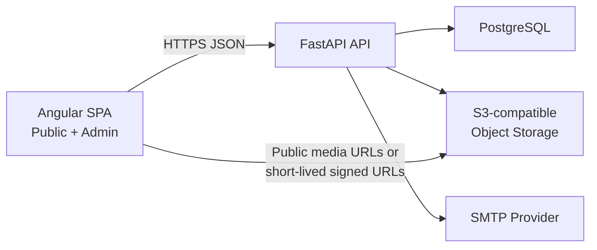
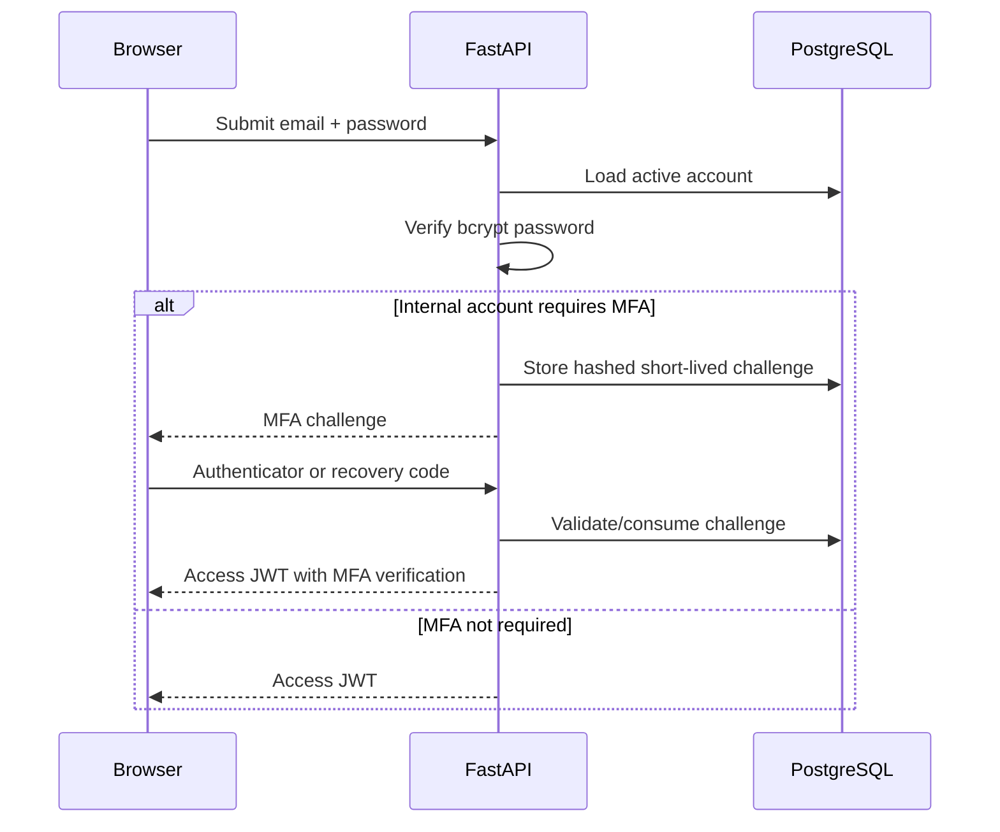
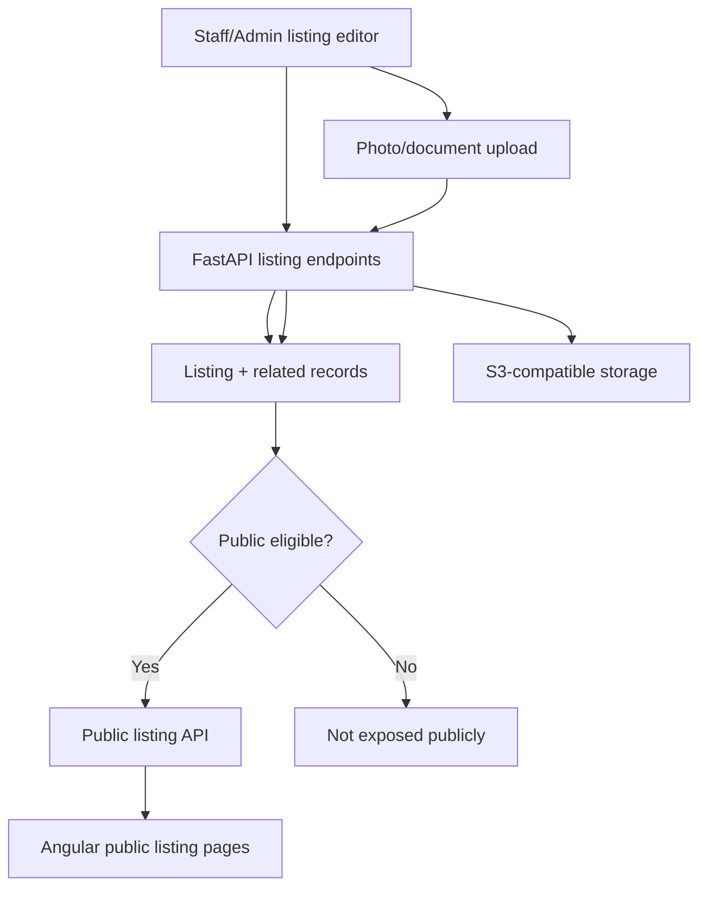
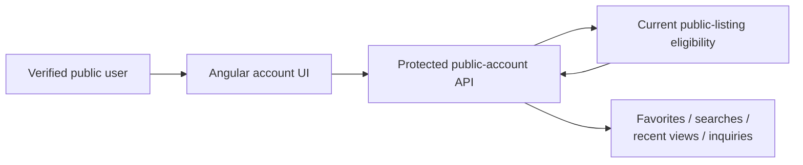
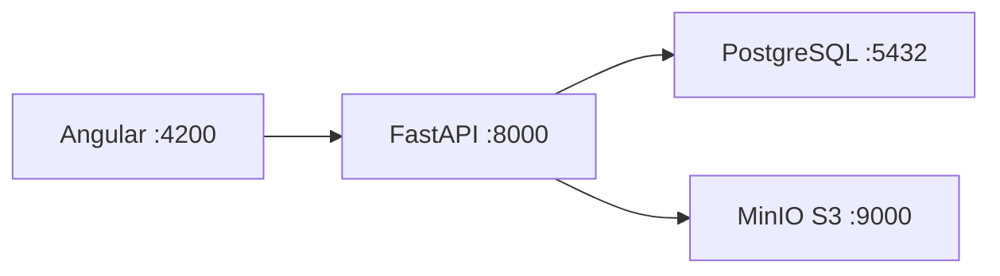
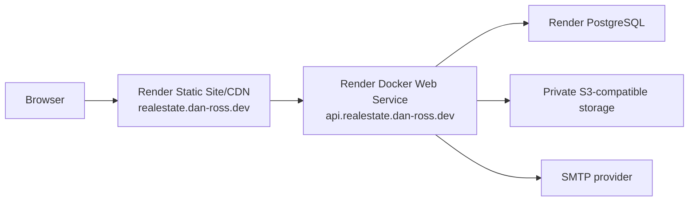

# Architecture and Data Flow

This document explains the major application boundaries and the decisions behind
them. It is intended both as project documentation and as a concise reference
for demos and interviews.

## System overview

The browser never connects directly to PostgreSQL or receives storage
credentials. FastAPI is the application boundary for authorization, validation,
business rules, and persistence.

## Frontend boundary

One Angular application contains two route areas.

### Public routes

The public route tree covers:

- homepage;
- listing browse/search/filter/sort/pagination;
- listing detail and staff/admin preview;
- public agent profiles;
- About, Contact, Privacy, and Terms pages;
- public account login/password recovery;
- customer dashboard, saved homes/searches, settings, and testimonial submission.

The public shell owns shared navigation, footer, privacy choices, page metadata,
and the main-content landmark.

### Admin routes

The `/admin` route tree covers:

- dashboard;
- listings and listing details/editing;
- users;
- agents;
- offices;
- site settings;
- security/MFA;
- analytics;
- leads;
- testimonials.

Angular guards improve the user experience by preventing inappropriate client
navigation, but they are not treated as the security boundary. FastAPI performs
the authoritative role checks for every protected operation.

## API and authorization boundary

FastAPI separates public endpoints from internal staff/admin operations.

The application uses three fixed roles:

| Role | Main responsibility |
| --- | --- |
| `public_user` | Customer account features such as favorites, saved searches, inquiries, and settings |
| `staff` | Internal brokerage operations such as listings, leads, analytics, and testimonials |
| `admin` | Staff capabilities plus user, agent, office, and site/security administration |

Protected dependencies validate the JWT, current account state, role, and where
required the internal MFA policy. Authorization remains server-side even when the
Angular route is already guarded.

## Authentication flow

JWTs include an explicit purpose, issuer, audience, expiry, role, and MFA state.
TOTP secrets are encrypted at rest. Recovery codes are stored only as keyed
hashes and are single-use.

A fresh environment contains no built-in admin credentials. The one-time
interactive bootstrap command can create the first administrator only while no
administrator exists.

## Listing lifecycle and publication

The internal application owns the editable listing record. A listing can contain
property facts, status, publication flags, photo metadata, documents, open
houses, agent relationships, and other public-facing information.

Public endpoints do not simply return every database row. They enforce public
eligibility rules before returning a listing.

This keeps Draft/Archived/non-public data out of anonymous responses instead of
relying on the frontend to hide it.

## Listing photo flow

Source photos are uploaded one at a time through FastAPI.

The backend:

1. validates upload limits and supported image formats;
2. processes/normalizes the image;
3. writes optimized variants to object storage;
4. stores only object keys and metadata in PostgreSQL;
5. returns browser-usable media references;
6. cleans newly uploaded objects when database persistence fails.

Gallery order and primary-photo selection are separate operations. Replacement
uploads the new media before retiring the previous objects so the database does
not intentionally point at missing media.

This design avoids permanent media on an ephemeral application filesystem and
keeps database records as the authoritative metadata.

## Public customer engagement

Verified public accounts can save homes, track recently viewed listings, store
search criteria, choose saved-search alert preferences, submit inquiries, and
manage account information.

The backend rechecks account and listing eligibility instead of trusting IDs
supplied by the browser.

## Leads and inquiries

Public contact/showing requests become operational lead records. Internal staff
can review status, assignment, notes, and source information through the admin
area.

This turns a public form into a full-stack workflow rather than treating form
submission as a standalone frontend feature.

## Analytics and exports

First-party listing-view analytics are privacy-minimized. Anonymous view events
store listing ID, normalized source category, optional external referrer
hostname, and timestamp rather than visitor identity or full browsing metadata.

Internal analytics combine view activity, inquiries/showings, and current
favorite relationships for operational reporting.

CSV export endpoints generate lead and analytics files on the server. Text values
that could be interpreted as spreadsheet formulas are escaped before export.

## Site settings and content

A singleton site-settings record controls brokerage identity, contact details,
homepage/about/legal content, public feature switches, privacy-consent options,
photo limits, and the internal-MFA requirement.

Public settings endpoints expose only values needed by anonymous pages. Internal
security settings are kept behind protected admin endpoints.

## SEO boundary

Angular sets route-specific titles, descriptions, canonical URLs, Open Graph
metadata, robots directives, and listing structured data.

FastAPI generates a sitemap source from current database state. Only eligible
public listings, public agents, and enabled content pages are included.

## Local architecture

Docker Compose supplies PostgreSQL and MinIO locally. The Angular dev server and
FastAPI typically run directly on the developer machine for fast reload cycles.

## Production topology

`render.yaml` defines the web service, static site, and PostgreSQL database.
Frontend API routing is injected during the production build rather than
hard-coded to localhost.

Before a backend release is started, Render runs Alembic migrations. The service
health check verifies PostgreSQL connectivity. CI also verifies a
production-style Angular build and the backend Docker image before deployment.

## Failure and recovery boundaries

Several design choices make failure behavior explicit:

- Alembic is the only schema migration path.
- Production startup fails fast for unsafe/incomplete production configuration.
- `/health` fails when PostgreSQL is unavailable.
- Permanent media is independent of the API container filesystem.
- Upload code attempts object cleanup when database persistence fails.
- Production deployment docs define database backup/restore and application
  rollback procedures.
- No default production administrator password exists.

## Key engineering decisions

### Backend authorization is authoritative

Angular guards are useful navigation controls, but security is enforced again in
FastAPI. A caller cannot gain a protected capability by bypassing the Angular UI.

### Public APIs return public-safe models

Anonymous listing and content responses are shaped specifically for public use.
Internal records and unpublished data are not merely hidden with CSS.

### Durable storage is separate from compute

PostgreSQL and S3-compatible storage survive web-service restarts/redeploys.
Render compute can therefore remain stateless.

### Deployment configuration is environment-driven

Secrets remain outside source control. The frontend receives only the public API
origin, while FastAPI receives database, JWT, SMTP, CORS, and storage settings
through server environment variables.

### Testing is part of the delivery path

Pull requests must build and run automated tests before merge. CI also tests
migrations, API startup/health, production frontend configuration, Blueprint
syntax, and Docker image creation.

## Interview/demo talking points

A useful way to explain the project is to focus on decisions rather than syntax:

- The public site and internal admin are one Angular application but use separate
  route trees and authorization expectations.
- FastAPI is the security and business-rule boundary; frontend guards are not
  trusted as authorization.
- Public listing eligibility is enforced server-side, which prevents Draft or
  private records from leaking through the API.
- Media was moved out of the application filesystem because production compute
  is ephemeral.
- Alembic, CI, health checks, and environment validation make deployment a
  repeatable workflow rather than a manual copy step.
- MFA, privacy-minimized analytics, accessible interactions, SEO, and recovery
  documentation were treated as launch work rather than afterthoughts.
